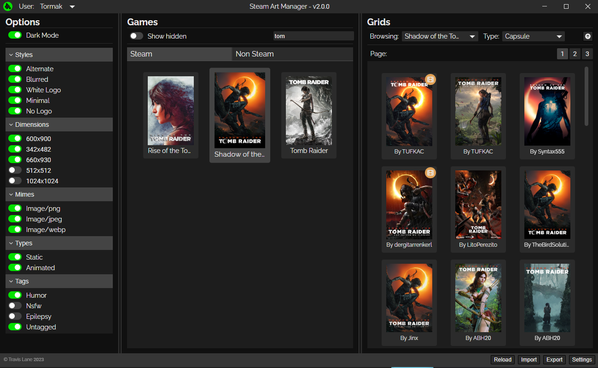

# Steam Art Manager
A tool for setting the artwork of your Steam library.



<br/>

## Features
 - Easily edit the art for your games
 - Upload custom images
 - Export your current art to a zip file
 - Import art from a zip file

## Download and Install
To get the most recent release, head to [releases](https://github.com/Tormak9970/Steam-Art-Manager/releases) and select the most recent release for your platform. Download it and run the installer.

## How to use the app
When using Steam Art Manager, your workflow will typically be:
 - Open Steam Art Manager
 - Set your SteamGridDB api key (if you wish to browse images from SteamGridDB)
 - Wait for it to load your games
 - Go through your games, setting the art to whatever you choose
 - Save the changes

### Setting up the API key
If you want to use or browse images from [SteamGridDB](https://steamgriddb.com) you will need an api key (which is easy and free). To get one:
 - First, go to [SteamGridDB](https://steamgriddb.com), and sign in with Steam.
 - Next, go to preferences, then API, and generate a new key if you don't already have one.
 - Now copy the api key.
 - Finally, in Steam Art Manager, click the "Set API Key" button and paste the key in the text field and click "Save".

### Managing your art
For custom artwork:
 - Click the "Upload Your Own!" button and select your file.

For SteamGridDB:
 - Browse through the images that show up when you select a game, and select one. It will be saved in memory until you apply your changes, so you can do as many as you want at once!

### Exporting to a Zip
In order to export the zip, simply wait for your games to load, and click the "Export Zip" button, and choose a save location!

### Importing from a Zip
To import a zip, click the "Import Zip" button and select your zip file and just like that all of your game art should be updated!

<br/>

## Building the app
**Please note:** you may edit and distrubute this program as you see fit but you must retain the license and the copyright notice I included (feel free to mark your contributions as I have). <br/>

### Setting Up the Enviroment
I used the Tauri framework for the program, so you will need to to setup your enviroment as specified [here](https://tauri.app/v1/guides/getting-started/prerequisites). Additionally, you need a [Node.js](https://nodejs.org/en/) installation, as well as `npm`, which should be included with the node install.

### Cloning the Program
The next step is to get a local copy of the repository. This can be done many ways, I recommend forking this repository and cloning that. <br/>

**IMPORTANT:**<br/>
If you make changes you are not allowed to redistribute the application with me labeled as the developer. Please remember to change the `author` information in the `package.json` and the related copyright information in `src-tauri/tauri.config.json` file. You should also change the copyright notice in `src/App.svelte`.

### Installing Dependencies
Once you have cloned the repository and opened it in your preffered Editor/IDE (I recommend [VSCode](https://code.visualstudio.com/)), you will need to install the program's dependencies. To do this, you will need to run two commands: <br/>
First:<br/>
```
npm i
```
Next:<br/>
```
cd src-tauri
cargo install
```

### Running the Application
Now you are finally ready to get the app up and running! Assuming everything is set up correctly, all you need to do is run:<br/>
```
npm run tauri dev
```

### Building With Your Changes
Once you have made your edits and are ready to share it with the world, run the following command:
```
npm run tauri build
```
This will generate a `.msi` file in `src-tauri/target/release/bundle/msi/app_name.msi`. And there you go, you've got a distributeable installer!

<br/>

## Acknowledgements
Big thanks to [doZenn](https://github.com/doZenn) for the advice and info on stuff related to steamgriddb. <br/>
Other resources / references I used:
 - [Steam ROM Manager](https://github.com/SteamGridDB/steam-rom-manager)
 - [SteamGrid Decky Plugin](https://github.com/SteamGridDB/decky-steamgriddb)
 - [SteamGridDB Boop](https://github.com/SteamGridDB/SGDBoop)
 - [binary vdf parser for js](https://github.com/cbartondock/node-binary-vdf)

<br/>

## Licensing
This program is licensed under the [GNU General Public License Version 3](https://www.gnu.org/licenses/#GPL)

Copyright Travis Lane (Tormak) 
